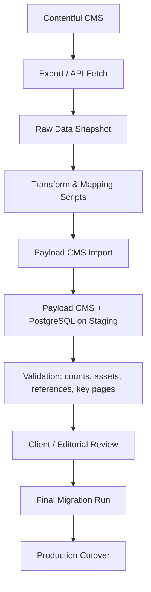

# Payload CMS Docker Starter

Minimal but production-leaning local development setup for Payload CMS with PostgreSQL.

## What this includes

- `app` service running Payload on top of Next.js
- `postgres` service with a persistent named volume
- environment-driven configuration
- local media storage mounted as a named volume
- basic health checks for both containers

## Migration flow

The goal is to make the migration controlled, repeatable, and transparent.



## Key principles

- keep raw Contentful export as a safe snapshot
- transform data with version-controlled scripts
- validate content before production cutover
- run migration first on staging
- switch production only after review

## Project structure

```text
.
├── Dockerfile
├── docker-compose.yml
├── src/
│   ├── app/
│   ├── collections/
│   └── payload.config.ts
└── .env.example
```

## Local run

1. Create your env file:

   ```bash
   cp .env.example .env
   ```

2. Set real secrets in `.env`:

   - `PAYLOAD_SECRET`
   - `POSTGRES_PASSWORD`

3. Start everything:

   ```bash
   docker compose up --build
   ```

4. Open:

   - app: `http://localhost:3000`
   - admin: `http://localhost:3000/admin`
   - health: `http://localhost:3000/api/health`

If there is no admin user yet, Payload will prompt you to create the first one in the admin UI.

## Environment model

Payload uses `DATABASE_URL` when it is present. If it is missing, the app derives the database settings from `POSTGRES_*` variables in code. That keeps local Docker setup simple while still letting DigitalOcean use one exact managed database URL.

For DigitalOcean App Platform or a managed Postgres setup, prefer setting `DATABASE_URL` and `DATABASE_CA_CERT` in the app environment. The app parses the URL into individual `pg` settings and passes the CA certificate explicitly, which avoids the SSL issues that can happen when relying on a single raw connection string with `sslmode` query parameters.

## Database troubleshooting

If local Postgres says `password authentication failed for user "payload"`, the most common cause is a stale Docker volume initialized with an older password. The `POSTGRES_*` values are only used when Postgres initializes the data directory for the first time.

To reset local data and reinitialize Postgres with the current `.env` values:

```bash
docker compose down -v
docker compose up --build
```

If you need to keep local data, change the password inside Postgres instead of only editing `.env`.

For DigitalOcean, verify that the app is using the exact managed database connection string from the control panel and that `DATABASE_CA_CERT` is attached as well.

## Migrations and schema changes

For a small local dev setup, the main flow is to start the stack and work from there. If you begin managing schema changes through Payload migrations later, run commands inside the app container:

```bash
docker compose exec app npm run payload migrate:create
docker compose exec app npm run payload migrate
```

You can also generate updated types when needed:

```bash
docker compose exec app npm run payload generate:types
```

## Media storage

Media currently uses local disk storage via the `media` collection and the `media` named volume. That keeps local development simple while isolating storage concerns in one place. When you move to S3 or DigitalOcean Spaces later, replace the local upload configuration in `src/collections/Media.ts` and add the corresponding adapter package and environment variables.

## Notes for deployment later

- App Platform: build the same app image, inject managed Postgres credentials as env vars, and replace local media storage with Spaces or S3.
- Droplet: keep Docker Compose, add a reverse proxy, TLS, backups, and a remote object store for media.
